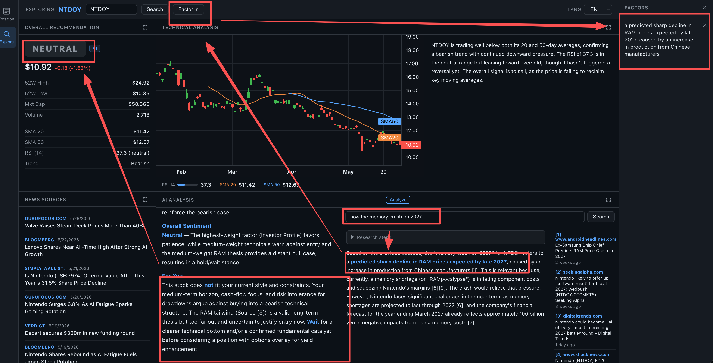

# StockMonitor

A personal stock intelligence dashboard — portfolio positions, candlestick charts, AI-powered stock exploration, and real-time quotes, all in one browser tab.

## Preview



**Backend:** FastAPI + `ib_insync` connecting to IB Gateway or TWS.  
**Frontend:** Plain HTML/JS (no build step) with TradingView Lightweight Charts.  
**AI:** DeepSeek for multi-stage stock analysis and internet research via Brave Search.  
**Data:** Interactive Brokers for live positions/quotes; Yahoo Finance as fallback.  
**Persistence:** SQLite (`data.db`) for investor profile and research factors.

---

## Quick Start

### 1. Prerequisites

- Python 3.11+
- IB Gateway or TWS running locally with API access enabled (see [Enabling API access](#enabling-api-access))
- A DeepSeek API key for AI analysis (optional — all other features work without it)
- A Brave Search API key for internet research queries (optional)

### 2. Install

```bash
cd stock_monitoring
pip install -r requirements.txt
```

### 3. Configure

```bash
cp .env.example .env
```

Edit `.env` with your values:

```env
IB_HOST=127.0.0.1
IB_PORT=4002
IB_CLIENT_ID=1
DEEPSEEK_API_KEY=your_key_here
BRAVE_SEARCH_API_KEY=your_key_here
```

### 4. Run

```bash
uvicorn main:app --reload
```

Open **http://localhost:8000**.

---

## Configuration

| Variable | Default | Description |
|---|---|---|
| `IB_HOST` | `127.0.0.1` | Hostname of the machine running IB Gateway / TWS |
| `IB_PORT` | `4002` | Port IB Gateway / TWS listens on (see table below) |
| `IB_CLIENT_ID` | `1` | Must be unique per simultaneous client connection |
| `DEEPSEEK_API_KEY` | _(unset)_ | Enables AI analysis, factor weighting, and technical commentary |
| `BRAVE_SEARCH_API_KEY` | _(unset)_ | Enables internet search queries in the AI Analysis panel |

### Common IB ports

| Application | Account type | Port |
|---|---|---|
| IB Gateway | Paper trading | `4002` |
| IB Gateway | Live trading | `4001` |
| TWS | Paper trading | `7497` |
| TWS | Live trading | `7496` |

### Enabling API access

**IB Gateway:** Configure → Settings → API → Enable ActiveX and Socket Clients  
**TWS:** Edit → Global Configuration → API → Settings → Enable ActiveX and Socket Clients

---

## Features

### Position Mode

Accessed via the **Position** tab in the left sidebar.

- **Portfolio panel** — account summary (Net Liq, Cash, Unrealized/Realized P&L) and positions table; click any row to load its chart and news
- **Chart panel** — candlestick chart with 5D / 1M / 3M / 1Y ranges and 1H / 1D bar sizes; live last-price ticker via WebSocket
- **News panel** — latest headlines with optional AI impact labels (Bullish / Bearish / Neutral)

### Explore Mode

Accessed via the **Explore** tab. Full-screen layout with four panels.

#### Overall Recommendation
Rules-based signal (Buy / Hold / Sell) from SMA crossover and RSI, with a plain-language summary.

#### Technical Analysis
Interactive candlestick chart with SMA-20 and SMA-50 overlays. An AI commentary panel interprets the indicators in 2–3 plain sentences.

#### News Sources
Latest headlines for the explored ticker from Yahoo Finance.

#### AI Analysis
Multi-stage DeepSeek analysis streamed live with visible progress steps:

1. **Stage 1 — Factor Weighting**: the model independently assesses three input sources — technical indicators, news headlines, and user-provided factors — and assigns each a direction (Bullish / Neutral / Bearish) and weight (High / Medium / Low).
2. **Stage 2 — Conclusion**: using the stage-1 weights as context, the model generates a structured recommendation: Bull Thesis, Bear Thesis, Near-Term Outlook, and Overall Sentiment. High-weight factors dominate the output.

Progress is shown in a live "Analysis steps" collapsible that auto-collapses when the result arrives. The stage-1 weighting is preserved as an expandable "Factor Weighting" block above the conclusion.

**Context injected into every analysis:**
- Real-time technical indicators (price, SMA-20/50, RSI, trend, 52-week range, market cap)
- Current date and time (UTC)
- User-provided factors from the Factor sidebar
- Investor profile from the Profile modal

#### Internet Search
Multi-step Brave Search query panel:
1. DeepSeek decomposes the question into 2–4 targeted sub-queries
2. Sub-queries run in parallel via Brave Search
3. Results are deduplicated and synthesised into a cited answer with source links

Selecting a factor in the sidebar automatically fires a contextual search for that factor.

---

### Factor Sidebar

Add research factors via the **Factor In** button in the Explore topbar. Each factor:

- Appears in a persistent right sidebar
- Is passed to AI analysis as "known facts" to incorporate into the recommendation
- Can be selected — clicking fires an internet search automatically
- Can be individually deleted or cleared in bulk
- **Persists in SQLite** across page refreshes

### Investor Profile

Click the **profile icon** (top-right header) to open the profile modal. Describe yourself as an investor in free text — style, risk tolerance, time horizon, goals, constraints. Quick-insert chips let you build the profile without typing.

The profile is injected into the AI system prompt for every analysis, framing the entire output from your investor perspective. **Persists in SQLite** across page refreshes.

---

## Project Structure

```
stock_monitoring/
├── main.py               # FastAPI app + lifespan (DB init, IB connect)
├── ib_client.py          # IBManager: connect, positions, quotes, bars, WebSocket
├── database.py           # SQLite helpers (profile + factors CRUD)
├── routers/
│   ├── portfolio.py      # GET /api/portfolio
│   ├── quotes.py         # GET /api/chart/{sym}, WS /api/ws/quotes/{sym}
│   ├── news.py           # GET /api/news/{sym}
│   ├── explore.py        # GET /api/explore/{sym}, /analysis (SSE), /query (SSE)
│   └── user.py           # /api/user/profile, /api/user/factors
├── static/
│   ├── index.html
│   ├── style.css
│   └── app.js
├── data.db               # SQLite database (gitignored, auto-created on first run)
├── .env                  # Local secrets (gitignored)
├── .env.example          # Safe template
├── requirements.txt
└── README.md
```

---

## API Reference

| Method | Path | Description |
|---|---|---|
| GET | `/api/status` | IB connection health |
| GET | `/api/portfolio` | Account summary + positions |
| GET | `/api/chart/{symbol}` | OHLCV bars (`duration`, `bar_size` params) |
| WS | `/api/ws/quotes/{symbol}` | Live quote stream |
| GET | `/api/news/{symbol}` | Headlines; `?analyze=true` adds AI impact labels |
| GET | `/api/explore/{symbol}` | Price, technicals, bars, news |
| GET | `/api/explore/{symbol}/technical` | AI technical commentary |
| GET | `/api/explore/{symbol}/analysis` | SSE — multi-stage AI analysis |
| GET | `/api/explore/{symbol}/query` | SSE — multi-step internet research |
| GET | `/api/user/profile` | Get investor profile |
| PUT | `/api/user/profile` | Save investor profile |
| GET | `/api/user/factors` | List factors |
| POST | `/api/user/factors` | Add a factor |
| DELETE | `/api/user/factors/{id}` | Remove one factor |
| DELETE | `/api/user/factors` | Clear all factors |

---

## Running Without IB

The server is fully functional when IB Gateway is not running:

- Chart and explore data fall back to Yahoo Finance automatically
- News always uses Yahoo Finance
- Portfolio and positions return empty results
- All Explore, AI analysis, and search features work independently of IB

---

## Troubleshooting

**Connection refused on startup** — Not fatal; the server logs it and continues. Check IB Gateway / TWS is running and API connections are enabled.

**Client ID conflict** — Change `IB_CLIENT_ID` in `.env` to any unused integer.

**AI analysis not working** — Confirm `DEEPSEEK_API_KEY` is set. The SSE stream returns a plain-text error if the key is missing.

**Internet search returns no results** — Confirm `BRAVE_SEARCH_API_KEY` is set.

**Live quotes silent** — IB only pushes ticks during market hours for symbols with active subscriptions.

**Yahoo Finance returns empty data** — `yfinance` occasionally rate-limits. Retry after a short wait.

---

## Next Steps

1. **Add time travel + regression test**
   - Introduce a "time travel" mode to replay historical market states and evaluate recommendation consistency at specific timestamps.
   - Add regression tests to lock expected outputs and prevent behavior drift after model/prompt/logic updates.

2. **Add Global Scan for high-value opportunities**
   - Build a global market scanner to search and rank stocks with strong investment value based on configurable filters (valuation, trend, momentum, quality, and risk).
   - Feed scan candidates into Explore mode for deeper AI analysis and thesis building.
